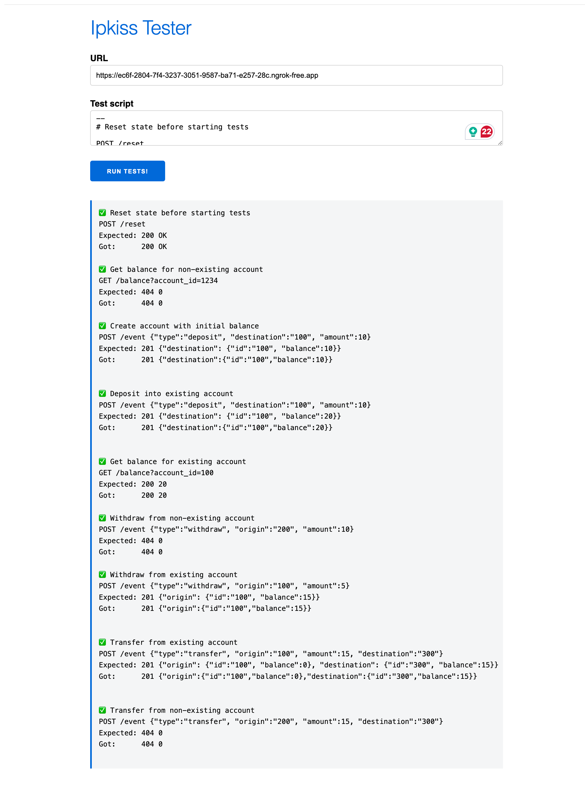

# EBANX Home Assignment

A clean, production-quality implementation of the [IPKISS API](https://ipkiss.pragmazero.com/) specification in Go.

## Overview

This project implements a simple banking API that supports core financial operations: deposits, withdrawals, transfers, and balance queries. Built with a layered architecture and production-ready patterns, it demonstrates clean code principles while maintaining simplicity.

## Features

- ✅ **Account Management**: Create accounts on-the-fly with deposits
- ✅ **Deposits**: Add funds to any account
- ✅ **Withdrawals**: Remove funds with balance validation
- ✅ **Transfers**: Move money between accounts atomically
- ✅ **Balance Queries**: Check account balances
- ✅ **State Reset**: Clear all data for testing
- ✅ **Thread-Safe**: Concurrent request handling with proper locking
- ✅ **Validated**: Input validation with detailed error messages

## Test Results



## Quick Start

### Prerequisites

- Go 1.25.1 or higher
- curl (for testing)

### Installation

```bash
# Clone the repository
git clone https://github.com/thihxm/ebanx-home-assignment.git
cd ebanx-home-assignment

# Download dependencies
go mod download

# Run the server
go run cmd/api/main.go
```

The server will start on `http://localhost:8080`.

### Quick Test

```bash
# Reset state
curl -X POST http://localhost:8080/reset

# Deposit $10 into account 100
curl -X POST http://localhost:8080/event \
  -H "Content-Type: application/json" \
  -d '{"type":"deposit", "destination":"100", "amount":10}'

# Check balance
curl http://localhost:8080/balance?account_id=100
# Response: 10
```

## API Endpoints

| Endpoint                   | Method | Description                       |
| -------------------------- | ------ | --------------------------------- |
| `/reset`                   | POST   | Reset all account balances        |
| `/balance?account_id={id}` | GET    | Get account balance               |
| `/event`                   | POST   | Process deposit/withdraw/transfer |

For detailed API documentation with examples, see [API_REFERENCE.md](./API_REFERENCE.md).

## Documentation

- **[API_REFERENCE.md](./API_REFERENCE.md)**: Complete API documentation with request/response examples and error codes
- **[ARCHITECTURE.md](./ARCHITECTURE.md)**: Architecture overview, design patterns, and implementation details

## Project Structure

```
ebanx-home-assignment/
├── cmd/
│   └── api/
│       └── main.go              # Application entry point
├── internal/
│   ├── domain/                  # Domain models & interfaces
│   │   ├── account.go
│   │   └── event.go
│   ├── handler/                 # HTTP handlers
│   │   ├── http.go
│   │   └── http_test.go
│   ├── repository/              # Data access layer
│   │   ├── in_memory.go
│   │   └── in_memory_test.go
│   └── service/                 # Business logic
│       ├── account_service.go
│       ├── account_service_test.go
│       ├── event_service.go
│       └── event_service_test.go
├── go.mod
├── go.sum
├── README.md
├── API_REFERENCE.md
├── ARCHITECTURE.md
└── test_results.png
```

## Architecture

The application follows a clean, layered architecture:

```
HTTP Handler → Service Layer → Repository → Domain Models
```

Key design patterns:

- **Repository Pattern**: Abstracts data access
- **Dependency Injection**: Loosely coupled components
- **Interface-based Design**: Domain-driven architecture
- **Thread Safety**: Concurrent-safe operations with `sync.RWMutex`

For detailed architecture documentation, see [ARCHITECTURE.md](./ARCHITECTURE.md).

## Testing

### Run Unit Tests

```bash
# Run all tests
go test ./...

# Run tests with coverage
go test -cover ./...

# Run tests with verbose output
go test -v ./...

# Run specific package tests
go test ./internal/service/...
```

### Integration Testing

```bash
# Start the server
go run cmd/api/main.go

# In another terminal, run test commands
curl -X POST http://localhost:8080/reset
curl -X POST http://localhost:8080/event \
  -H "Content-Type: application/json" \
  -d '{"type":"deposit", "destination":"100", "amount":10}'
curl http://localhost:8080/balance?account_id=100
```

See [API_REFERENCE.md](./API_REFERENCE.md#complete-usage-example) for a complete test workflow.

## Development

### Building

```bash
# Build binary
go build -o dist/api cmd/api/main.go

# Run binary
./dist/api
```

### Dependencies

- **go-playground/validator**: Request validation with struct tags
- **go-playground/universal-translator**: i18n support for validation errors
- Go standard library: `net/http`, `encoding/json`, `sync`

## Tech Stack

- **Language**: Go 1.25.1
- **Architecture**: Layered (Handler → Service → Repository → Domain)
- **Storage**: In-memory (thread-safe map with RWMutex)
- **Validation**: go-playground/validator v10
- **Testing**: Go standard testing package

## Requirements Checklist

- [x] GET `/balance?account_id={account_id}` - Get the balance of an account
- [x] POST `/event` - Deposit money into an account
- [x] POST `/event` - Withdraw money from an account
- [x] POST `/event` - Transfer money from one account to another
- [x] POST `/reset` - Reset state before starting tests

## Design Decisions

### Why In-Memory Storage?

- Simplicity (as required)
- No external dependencies
- Fast performance
- Easy testing
- Production-ready patterns (easy to swap with database)

### Why Layered Architecture?

- Clear separation of concerns
- Testable in isolation
- Easy to extend
- Follows SOLID principles

## License

This is a take-home assignment project for EBANX.

## Author

Thiago Medeiros ([@thihxm](https://github.com/thihxm))
